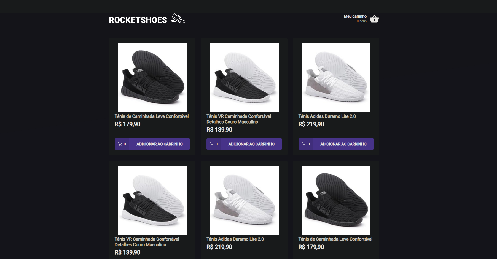

# ignite-reactjs-criando-um-hook-de-carrinho-de-compras

Este projeto é parte do Ignite da Rocketseat e tem como objetivo criar um hook de carrinho de compras em uma aplicação ReactJS. 

O hook de carrinho de compras permitirá aos usuários adicionar produtos ao carrinho, remover produtos, alterar quantidades e calcular o total da compra. O desafio é implementar de forma eficiente a lógica do carrinho de compras utilizando React Hooks.
## Rodando localmente

Clone o projeto

```bash
  git clone https://github.com/IsraelBarbosa/ignite-reactjs-criando-um-hook-de-carrinho-de-compras.git
```

Entre no diretório do projeto

```bash
  cd ignite-reactjs-criando-um-hook-de-carrinho-de-compras
```

Instale as dependências

```bash
  yarn
```

Inicie o json-server

```bash
  yarn server
```

Inicie o servidor

```bash
  yarn start
```

Inicie os testes

```bash
  yarn test
```


## Stack utilizada

* React
* TypeScript
* styled-components


## Aprendizados

* React com typeScript
* Utilizar o context api
* Utilizar um hook customizado
* Utilizar o react-router-dom
* Utilizar o axios
* Api mocking com o json-server
* Utilizar o Styled-components
* Utilizar o react-toastify
* Uso da unidade de medida REM
* Testes com jest


## Screenshots



